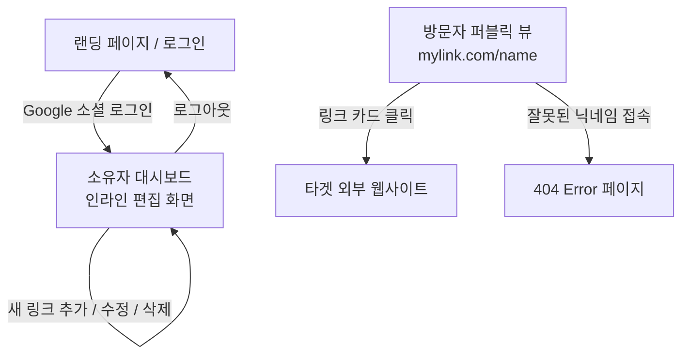

# 마이링크 (MyLink) - 와이어프레임 및 화면 설계 (Wireframes)

이 문서는 MyLink 프로젝트의 전반적인 화면 구성과 흐름을 Mermaid.js 다이어그램과 ASCII 아트를 사용하여 정의합니다. 모바일 퍼스트(Mobile-First) 디자인을 적용하며 UI 컴포넌트는 `shadcn/ui`를 기준으로 설계되었습니다.

---

## 1. 전체 화면 흐름도 (Screen Flow)



---

## 2. ASCII 아트 와이어프레임

### 2.1. 랜딩 페이지 (Landing Page)
초기 방문자가 가입 및 로그인을 진행하는 화면입니다.

```text
+-----------------------------------+
|                                   |
|             M Y L I N K           |
|                                   |
|   나만의 모든 링크를 하나로!      |
|   1분 만에 프로필을 만드세요.     |
|                                   |
|                                   |
|  +-----------------------------+  |
|  |  (G) Google 계정으로 시작   |  |
|  +-----------------------------+  |
|                                   |
|                                   |
+-----------------------------------+
```
**[사용될 shadcn/ui 컴포넌트]**
- `Typography` (h1, p)
- `Button` (Google 로그인 버튼 - outline 똔 default 스타일)

---

### 2.2. 소유자 대시보드 (Owner Dashboard - 인라인 편집 모드)
로그인한 소유자가 보게 되는 메인 화면입니다. 폼(Form) 없이 텍스트를 바로 클릭해 수정(Inline-edit)합니다.

```text
+-----------------------------------+
|  [주소복사]              [로그아웃]| <- 헤더 컨트롤
|                                   |
|              ( O_O )              | <- 아바타 (기본 이미지)
|                                   |
|        [ displayName  ✎ ]         | <- 닉네임 (클릭 시 인라인 수정)
|     [ 짧은 프로필 소개글  ✎ ]       | <- 소개글 (클릭 시 인라인 수정)
|                                   |
|  +-----------------------------+  |
|  | [🌐] 내 기술 블로그 ✎    [🗑]|  | <- 기존 링크 1 (파비콘 + 제목) 
|  +-----------------------------+  |
|  +-----------------------------+  |
|  | [🐙] 내 깃허브 주소 ✎    [🗑]|  | <- 기존 링크 2
|  +-----------------------------+  |
|                                   |
|  +-----------------------------+  |
|  |  ➕  새 링크 추가하기         |  | <- 링크 추가 인라인 라인 삽입
|  +-----------------------------+  |
|                                   |
+-----------------------------------+
```
**[사용될 shadcn/ui 컴포넌트]**
- `Avatar` (기본 구글 아바타 표시)
- `Card` (링크들을 감싸는 컨테이너)
- `Button` (복사, 로그아웃, 추가 액션, 삭제 휴지통 아이콘)
- `Input` / `Textarea` (인라인 수정 시 일반 텍스트가 Input 폼으로 전환)
- `AlertDialog` (삭제 전 확인 팝업)

---

### 2.3. 방문자 퍼블릭 뷰 (Visitor Public View)
방문자가 보게 될 화면입니다. 소유자 화면과 거의 동일하나, 수정 연필 기호(✎)나 삭제 버튼(🗑), 상단 헤더의 컨트롤 버튼이 보이지 않습니다.

```text
+-----------------------------------+
|                                   |
|                                   |
|              ( O_O )              |
|                                   |
|            displayName            |
|         짧은 프로필 소개글        |
|                                   |
|  +-----------------------------+  |
|  | [🌐] 내 기술 블로그         |  | <- 클릭 시 외부로 이동
|  +-----------------------------+  |
|  +-----------------------------+  |
|  | [🐙] 내 깃허브 주소         |  | <- 클릭 시 외부로 이동
|  +-----------------------------+  |
|                                   |
|                                   |
+-----------------------------------+
```
**[사용될 shadcn/ui 컴포넌트]**
- 대시보드에서 사용한 것과 동일한 컴포넌트들을 **Read-Only** 상태로 재사용합니다.

---
*문서 작성 및 수정일: 2026-03-24*
